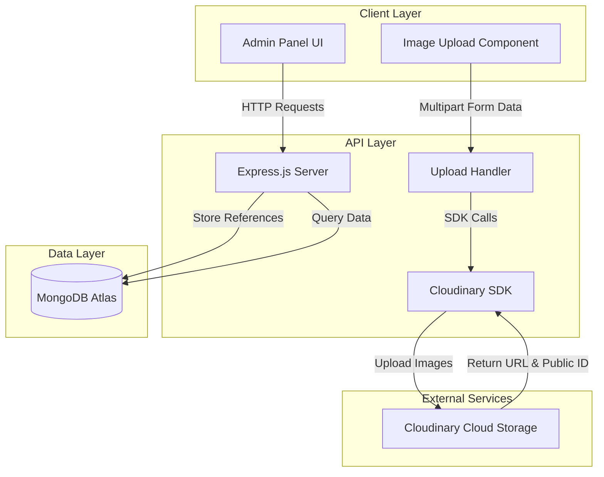
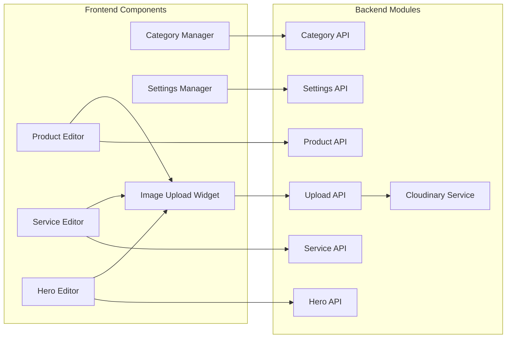

# Design Document: Admin Panel with Cloudinary Integration

## Overview

This design document outlines the technical architecture for integrating Cloudinary cloud storage into the Fakhem Perfumes admin panel. The system will replace the current Base64 image storage approach with a cloud-based solution, providing scalable image management while maintaining backward compatibility with existing data.

The implementation involves three primary layers:
1. **Frontend Admin Interface**: React-based admin panel with image upload UI components
2. **Backend API Layer**: Express.js endpoints handling Cloudinary integration and CRUD operations
3. **Data Layer**: MongoDB Atlas for structured data storage with Cloudinary references

**Key Design Goals:**
- Migrate from Base64 database storage to Cloudinary cloud storage
- Maintain backward compatibility during migration period
- Provide comprehensive admin interface for all content types
- Ensure secure credential management
- Optimize performance with cloud-based image delivery

## Architecture

### System Architecture Diagram



### Component Architecture



## Components and Interfaces

### 1. Cloudinary Service Module

**Purpose**: Encapsulate all Cloudinary SDK interactions and provide a clean interface for image operations.

**Location**: `api/services/cloudinary.service.js`

**Interface**:

```javascript
class CloudinaryService {
  /**
   * Initialize Cloudinary configuration from environment variables
   * @throws {Error} If required environment variables are missing
   */
  constructor()

  /**
   * Upload a single image to Cloudinary
   * @param {Buffer} fileBuffer - Image file buffer
   * @param {Object} options - Upload options (folder, transformation, etc.)
   * @returns {Promise<{url: string, publicId: string}>}
   */
  async uploadImage(fileBuffer, options)

  /**
   * Upload multiple images to Cloudinary
   * @param {Array<Buffer>} fileBuffers - Array of image file buffers
   * @param {Object} options - Upload options
   * @returns {Promise<Array<{url: string, publicId: string}>>}
   */
  async uploadImages(fileBuffers, options)

  /**
   * Delete an image from Cloudinary by public ID
   * @param {string} publicId - Cloudinary public ID
   * @returns {Promise<{result: string}>}
   */
  async deleteImage(publicId)

  /**
   * Delete multiple images from Cloudinary
   * @param {Array<string>} publicIds - Array of Cloudinary public IDs
   * @returns {Promise<Array<{result: string}>>}
   */
  async deleteImages(publicIds)

  /**
   * Extract public ID from Cloudinary URL
   * @param {string} url - Cloudinary image URL
   * @returns {string|null} - Public ID or null if not a Cloudinary URL
   */
  extractPublicId(url)

  /**
   * Check if a string is a Cloudinary URL
   * @param {string} str - String to check
   * @returns {boolean}
   */
  isCloudinaryUrl(str)

  /**
   * Check if a string is a Base64 encoded image
   * @param {string} str - String to check
   * @returns {boolean}
   */
  isBase64Image(str)
}
```

### 2. Upload API Handler

**Purpose**: Handle multipart form data image uploads and coordinate with Cloudinary service.

**Location**: `api/routes/upload.routes.js`

**Endpoints**:

```javascript
/**
 * POST /api/upload
 * Upload one or more images to Cloudinary
 * 
 * Request: multipart/form-data with 'images' field
 * Response: {
 *   success: boolean,
 *   images: Array<{url: string, publicId: string}>,
 *   message?: string
 * }
 */
router.post('/api/upload', upload.array('images', 10), async (req, res))

/**
 * DELETE /api/upload/:publicId
 * Delete an image from Cloudinary
 * 
 * Response: {
 *   success: boolean,
 *   message: string
 * }
 */
router.delete('/api/upload/:publicId', async (req, res))
```

### 3. Product Management API

**Purpose**: CRUD operations for products with Cloudinary image references.

**Location**: `api/routes/products.routes.js`

**Endpoints** (updated for Cloudinary):

```javascript
/**
 * GET /api/products
 * Retrieve all products sorted by order
 */
router.get('/api/products', async (req, res))

/**
 * POST /api/products
 * Create new product with Cloudinary image URLs
 * 
 * Body: {
 *   name: string,
 *   category: string,
 *   badge: string,
 *   images: Array<{src: string, overlay: Object}>,
 *   sizes: Array<{size: string, price: number}>
 * }
 */
router.post('/api/products', async (req, res))

/**
 * PUT /api/products/:id
 * Update existing product
 */
router.put('/api/products/:id', async (req, res))

/**
 * DELETE /api/products/:id
 * Delete product and associated Cloudinary images
 */
router.delete('/api/products/:id', async (req, res))

/**
 * PUT /api/products/reorder
 * Reorder products via drag-and-drop
 */
router.put('/api/products/reorder', async (req, res))
```

### 4. Image Upload Widget Component

**Purpose**: Reusable React component for image uploads with Cloudinary integration.

**Location**: `src/components/ImageUploadWidget.jsx`

**Props Interface**:

```javascript
interface ImageUploadWidgetProps {
  images: Array<string>           // Current image URLs
  onImagesChange: (urls: Array<string>) => void  // Callback for image changes
  maxImages?: number              // Maximum number of images (default: 10)
  folder?: string                 // Cloudinary folder for organization
  showProgress?: boolean          // Show upload progress (default: true)
  allowOverlay?: boolean          // Allow text overlay configuration (default: false)
}
```

### 5. Category Management API

**Purpose**: CRUD operations for product categories.

**Location**: `api/routes/categories.routes.js`

**Endpoints** (unchanged structure):

```javascript
router.get('/api/categories', async (req, res))
router.post('/api/categories', async (req, res))
router.put('/api/categories/:id', async (req, res))
router.delete('/api/categories/:id', async (req, res))
router.put('/api/categories/reorder', async (req, res))
```

### 6. Service Management API

**Purpose**: CRUD operations for services with Cloudinary image support.

**Location**: `api/routes/services.routes.js`

**Endpoints**:

```javascript
router.get('/api/services', async (req, res))
router.post('/api/services', async (req, res))
router.put('/api/services/:id', async (req, res))
router.delete('/api/services/:id', async (req, res))
```

### 7. Hero Section API

**Purpose**: Manage hero section content with Cloudinary circle images.

**Location**: `api/routes/hero.routes.js`

**Endpoints**:

```javascript
/**
 * GET /api/hero
 * Retrieve hero section content
 */
router.get('/api/hero', async (req, res))

/**
 * PUT /api/hero
 * Update hero section with new content and images
 * 
 * Body: {
 *   circles: Array<string>,  // Cloudinary URLs
 *   title: string,
 *   subtitle: string,
 *   badge: string,
 *   ctaText: string
 * }
 */
router.put('/api/hero', async (req, res))
```

### 8. Settings Management API

**Purpose**: Manage site-wide settings including logo.

**Location**: `api/routes/settings.routes.js`

**Endpoints**:

```javascript
/**
 * GET /api/settings
 * Retrieve site settings
 */
router.get('/api/settings', async (req, res))

/**
 * PUT /api/settings
 * Update site settings
 * 
 * Body: {
 *   whatsapp: string,
 *   instagram: string,
 *   facebook: string,
 *   footerText: string,
 *   copyrightText: string,
 *   premiumThreshold: number,
 *   logo: string  // Cloudinary URL
 * }
 */
router.put('/api/settings', async (req, res))
```

## Data Models

### Product Model (Updated)

```javascript
const ProductSchema = new mongoose.Schema({
  name: { 
    type: String, 
    required: true,
    trim: true,
    minlength: 1
  },
  category: { 
    type: String, 
    default: '',
    trim: true
  },
  badge: { 
    type: String, 
    default: '',
    enum: ['', 'فاخر', 'جديد', 'عرض خاص', 'الأكثر مبيعاً']
  },
  images: [{
    src: { 
      type: String, 
      required: true 
    },  // Cloudinary URL or Base64 (backward compatible)
    publicId: { 
      type: String 
    },  // Cloudinary public ID (null for Base64)
    overlay: {
      text: String,
      bgColor: String,
      bgOpacity: Number,
      textColor: String,
      fontSize: Number,
      position: { 
        type: String, 
        enum: ['top', 'center', 'bottom'] 
      }
    }
  }],
  sizes: [{
    size: { 
      type: String, 
      required: true 
    },
    price: { 
      type: Number, 
      required: true,
      min: 0 
    }
  }],
  order: { 
    type: Number, 
    default: 0,
    index: true
  }
}, {
  timestamps: true
});

// Index for efficient sorting
ProductSchema.index({ order: 1 });
```

### Category Model

```javascript
const CategorySchema = new mongoose.Schema({
  name: { 
    type: String, 
    required: true,
    trim: true,
    minlength: 1,
    unique: true
  },
  order: { 
    type: Number, 
    default: 0,
    index: true
  }
}, {
  timestamps: true
});

CategorySchema.index({ order: 1 });
```

### Service Model (Updated)

```javascript
const ServiceSchema = new mongoose.Schema({
  name: { 
    type: String, 
    required: true,
    trim: true,
    minlength: 1
  },
  desc: { 
    type: String, 
    required: true,
    trim: true,
    minlength: 1
  },
  icon: { 
    type: String, 
    default: '' 
  },
  images: [{
    src: String,      // Cloudinary URL or Base64
    publicId: String  // Cloudinary public ID (null for Base64)
  }],
  isCustom: { 
    type: Boolean, 
    default: true 
  },
  order: { 
    type: Number, 
    default: 0,
    index: true
  }
}, {
  timestamps: true
});

ServiceSchema.index({ order: 1 });
```

### Hero Model (Updated)

```javascript
const HeroSchema = new mongoose.Schema({
  circles: [{
    src: String,      // Cloudinary URL or Base64
    publicId: String  // Cloudinary public ID (null for Base64)
  }],
  title: { 
    type: String, 
    default: '' 
  },
  subtitle: { 
    type: String, 
    default: '' 
  },
  badge: { 
    type: String, 
    default: '' 
  },
  ctaText: { 
    type: String, 
    default: 'تصفح المجموعة' 
  }
}, {
  timestamps: true
});
```

### Settings Model (Updated)

```javascript
const SettingsSchema = new mongoose.Schema({
  whatsapp: { 
    type: String, 
    default: '',
    validate: {
      validator: function(v) {
        return !v || /^\d+$/.test(v);
      },
      message: 'WhatsApp number must contain only digits'
    }
  },
  instagram: { 
    type: String, 
    default: '',
    validate: {
      validator: function(v) {
        return !v || /^https?:\/\/(www\.)?instagram\.com\/.+/.test(v);
      },
      message: 'Invalid Instagram URL'
    }
  },
  facebook: { 
    type: String, 
    default: '',
    validate: {
      validator: function(v) {
        return !v || /^https?:\/\/(www\.)?facebook\.com\/.+/.test(v);
      },
      message: 'Invalid Facebook URL'
    }
  },
  footerText: { 
    type: String, 
    default: '' 
  },
  copyrightText: { 
    type: String, 
    default: '© 2025 فخم - جميع الحقوق محفوظة' 
  },
  premiumThreshold: { 
    type: Number, 
    default: 700,
    min: 0
  },
  logo: {
    src: String,      // Cloudinary URL or Base64
    publicId: String  // Cloudinary public ID (null for Base64)
  }
}, {
  timestamps: true
});
```

## Correctness Properties

*A property is a characteristic or behavior that should hold true across all valid executions of a system—essentially, a formal statement about what the system should do. Properties serve as the bridge between human-readable specifications and machine-verifiable correctness guarantees.*

### Property 1: Cloudinary URL Format Validation

*For any* string that is identified as a Cloudinary URL, it SHALL match the pattern `https://res.cloudinary.com/{cloud_name}/` and return `true` when passed to `isCloudinaryUrl()`.

**Validates: Requirements 1.6, 9.4**

### Property 2: Base64 Image Detection

*For any* string that is identified as a Base64 image, it SHALL start with the pattern `data:image/` and return `true` when passed to `isBase64Image()`.

**Validates: Requirements 12.3**

### Property 3: Public ID Extraction Consistency

*For any* valid Cloudinary URL, extracting the public ID and then reconstructing a URL with that public ID SHALL produce a functionally equivalent URL pointing to the same resource.

**Validates: Requirements 1.3, 9.4**

### Property 4: URL Validation for Social Media

*For any* Instagram URL that passes validation, it SHALL match the pattern `https?://(www\.)?instagram\.com/.+`, and similarly for Facebook URLs with the Facebook domain.

**Validates: Requirements 8.7**

### Property 5: Image Format Support

*For any* uploaded image with MIME type of `image/jpeg`, `image/png`, `image/webp`, or `image/gif`, the upload handler SHALL accept the file and not return a format error.

**Validates: Requirements 9.6**

### Property 6: Image Upload Count Limit

*For any* upload request containing N image files where N ≤ 10, the upload handler SHALL process all N images and return N image URLs. For any request where N > 10, the handler SHALL reject the upload or process only the first 10 images.

**Validates: Requirements 9.5**

### Property 7: Required Field Validation

*For any* entity (product, category, or service) where any required field (name for products/categories, name and description for services) is an empty string or contains only whitespace, the validation SHALL fail and prevent saving to the database.

**Validates: Requirements 3.9, 4.6, 5.8**

### Property 8: Logo File Size Validation

*For any* uploaded logo file with size S bytes where S ≤ 5,242,880 (5MB), the upload SHALL be accepted. For any file where S > 5,242,880, the upload SHALL be rejected with a size validation error.

**Validates: Requirements 7.6**

## Error Handling

### Error Categories and Handling Strategy

#### 1. Cloudinary Integration Errors

**Scenarios**:
- Missing or invalid credentials
- Network timeout during upload
- Cloudinary service unavailable
- Invalid file format
- File size exceeds Cloudinary limits

**Handling**:
```javascript
try {
  const result = await cloudinary.uploader.upload(fileBuffer);
  return { success: true, url: result.secure_url, publicId: result.public_id };
} catch (error) {
  if (error.http_code === 401) {
    throw new Error('Cloudinary authentication failed. Check credentials.');
  } else if (error.http_code === 400) {
    throw new Error(`Invalid upload request: ${error.message}`);
  } else if (error.code === 'ETIMEDOUT') {
    throw new Error('Upload timeout. Please try again.');
  } else {
    throw new Error(`Upload failed: ${error.message}`);
  }
}
```

#### 2. Validation Errors

**Scenarios**:
- Empty required fields
- Invalid URL formats
- Invalid file types
- File size exceeds limits

**Handling**:
```javascript
// Mongoose validation
const product = new Product(data);
await product.validate(); // Throws ValidationError with detailed messages

// Custom validation
if (!data.name || data.name.trim().length === 0) {
  throw new ValidationError('Product name is required and cannot be empty');
}

// URL validation
if (data.instagram && !isValidInstagramUrl(data.instagram)) {
  throw new ValidationError('Invalid Instagram URL format');
}
```

#### 3. Database Operation Errors

**Scenarios**:
- Connection failures
- Duplicate key violations
- Document not found
- Transaction failures

**Handling**:
```javascript
try {
  await Product.findByIdAndUpdate(id, data, { new: true });
} catch (error) {
  if (error.code === 11000) {
    throw new Error('Duplicate entry. A record with this value already exists.');
  } else if (error.name === 'CastError') {
    throw new Error('Invalid ID format');
  } else if (error.name === 'DocumentNotFoundError') {
    throw new Error('Product not found');
  } else {
    throw new Error(`Database operation failed: ${error.message}`);
  }
}
```

#### 4. File Upload Errors

**Scenarios**:
- No files in request
- Multer parsing errors
- Memory limits exceeded

**Handling**:
```javascript
app.post('/api/upload', upload.array('images', 10), (req, res, next) => {
  if (!req.files || req.files.length === 0) {
    return res.status(400).json({ 
      success: false, 
      message: 'No files uploaded' 
    });
  }
  next();
}, uploadHandler);

// Multer error handling
app.use((error, req, res, next) => {
  if (error instanceof multer.MulterError) {
    if (error.code === 'LIMIT_FILE_SIZE') {
      return res.status(400).json({ 
        success: false, 
        message: 'File size exceeds limit' 
      });
    } else if (error.code === 'LIMIT_FILE_COUNT') {
      return res.status(400).json({ 
        success: false, 
        message: 'Too many files' 
      });
    }
  }
  next(error);
});
```

#### 5. Environment Configuration Errors

**Scenarios**:
- Missing environment variables
- Invalid credential format

**Handling**:
```javascript
function validateEnvironment() {
  const required = [
    'MONGO_URI',
    'CLOUDINARY_CLOUD_NAME',
    'CLOUDINARY_API_KEY',
    'CLOUDINARY_API_SECRET'
  ];
  
  const missing = required.filter(key => !process.env[key]);
  
  if (missing.length > 0) {
    throw new Error(
      `Missing required environment variables: ${missing.join(', ')}\n` +
      'Please check your .env file.'
    );
  }
}

// Call during server startup
try {
  validateEnvironment();
} catch (error) {
  console.error('Configuration Error:', error.message);
  process.exit(1);
}
```

### Frontend Error Handling

```javascript
// API call with error handling
async function uploadImages(files) {
  try {
    setUploading(true);
    setError(null);
    
    const formData = new FormData();
    files.forEach(file => formData.append('images', file));
    
    const response = await axios.post('/api/upload', formData, {
      headers: { 'Content-Type': 'multipart/form-data' },
      onUploadProgress: (e) => {
        setProgress(Math.round((e.loaded * 100) / e.total));
      },
      timeout: 30000 // 30 second timeout
    });
    
    return response.data.images;
  } catch (error) {
    if (error.code === 'ECONNABORTED') {
      setError('Upload timeout. Please try again with smaller files.');
    } else if (error.response) {
      setError(error.response.data.message || 'Upload failed');
    } else if (error.request) {
      setError('Network error. Please check your connection.');
    } else {
      setError('An unexpected error occurred');
    }
    throw error;
  } finally {
    setUploading(false);
  }
}
```

## Testing Strategy

### Testing Approach

This feature requires a **dual testing strategy** combining:

1. **Example-Based Unit Tests**: For specific scenarios, CRUD operations, and integration points
2. **Property-Based Tests**: For validation logic, URL parsing, and format detection (limited scope)
3. **Integration Tests**: For Cloudinary API interactions and database operations
4. **Manual Testing**: For UI interactions and visual verification

### Property-Based Testing (Limited Scope)

**Library**: fast-check (already in devDependencies)

**Applicable Areas**:
- URL validation logic
- Format detection (Cloudinary URL vs Base64)
- Public ID extraction
- Input sanitization

**Configuration**:
- Minimum 100 iterations per property test
- Each test must reference its design document property
- Tag format: **Feature: admin-panel-cloudinary, Property {number}: {property_text}**

**Example Test Structure**:

```javascript
const fc = require('fast-check');

// Feature: admin-panel-cloudinary, Property 1: Cloudinary URL Format Validation
describe('Cloudinary URL Validation', () => {
  it('should correctly identify valid Cloudinary URLs', () => {
    fc.assert(
      fc.property(
        fc.string(),
        fc.string(),
        (cloudName, path) => {
          const url = `https://res.cloudinary.com/${cloudName}/${path}`;
          const result = isCloudinaryUrl(url);
          return result === true;
        }
      ),
      { numRuns: 100 }
    );
  });
});
```

### Example-Based Unit Tests

**Test Coverage**:

1. **Cloudinary Service Tests**
   - Upload single image
   - Upload multiple images
   - Delete image by public ID
   - Extract public ID from URL
   - Handle upload failures
   - Handle invalid credentials

2. **API Route Tests**
   - Product CRUD operations
   - Category CRUD operations
   - Service CRUD operations
   - Hero section updates
   - Settings updates
   - Upload endpoint with various file types
   - Error responses for invalid requests

3. **Validation Tests**
   - Empty product name rejection
   - Empty category name rejection
   - Empty service name/description rejection
   - Invalid URL format rejection
   - File size limit enforcement
   - File count limit enforcement

4. **Backward Compatibility Tests**
   - Display existing Base64 images
   - Detect Base64 vs Cloudinary format
   - Migration from Base64 to Cloudinary

### Integration Tests

**Test Scenarios**:

1. **Cloudinary Integration**
   - End-to-end image upload to Cloudinary (using test credentials)
   - Image deletion from Cloudinary
   - URL generation and accessibility

2. **Database Integration**
   - Product with Cloudinary images persistence
   - Service with images persistence
   - Hero section with circle images persistence
   - Logo update in settings

3. **Migration Scenarios**
   - Edit product with Base64 images
   - Replace Base64 with Cloudinary URLs
   - Mixed Base64 and Cloudinary images in same product

### Mock Strategy

For unit tests that don't require actual Cloudinary calls:

```javascript
// Mock Cloudinary SDK
jest.mock('cloudinary', () => ({
  v2: {
    config: jest.fn(),
    uploader: {
      upload: jest.fn().mockResolvedValue({
        secure_url: 'https://res.cloudinary.com/test/image/upload/v123/test.jpg',
        public_id: 'test/image123'
      }),
      destroy: jest.fn().mockResolvedValue({ result: 'ok' })
    }
  }
}));
```

### Test File Structure

```
test/
├── unit/
│   ├── cloudinary.service.test.js
│   ├── validation.test.js
│   ├── url-parsing.test.js (property-based)
│   └── format-detection.test.js (property-based)
├── integration/
│   ├── upload-api.test.js
│   ├── products-api.test.js
│   ├── services-api.test.js
│   └── settings-api.test.js
└── e2e/
    └── admin-panel.test.js
```

### Performance Testing

**Target Metrics** (from Requirements 10):
- Products list load: < 2 seconds
- Categories list load: < 1 second
- Services list load: < 2 seconds
- Image upload: Show progress, warn if > 5 seconds

**Test Approach**:
- Use supertest with response time assertions
- Test with varying data set sizes (10, 50, 100 products)
- Test image uploads with varying file sizes (100KB, 1MB, 5MB)

### Testing Guidelines

1. **Unit Tests**: Focus on pure logic without external dependencies
2. **Integration Tests**: Use test environment with separate Cloudinary folder
3. **Property Tests**: Use fast-check generators for edge cases
4. **Avoid**: Over-testing external service behavior (Cloudinary's responsibility)
5. **Focus**: Test OUR code's interaction with Cloudinary, not Cloudinary itself

### Continuous Integration

- Run unit tests on every commit
- Run integration tests on pull requests
- Use separate test environment variables for CI
- Mock Cloudinary in CI for fast unit tests
- Run full integration tests nightly with real Cloudinary test account

